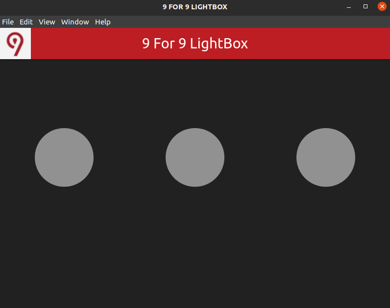
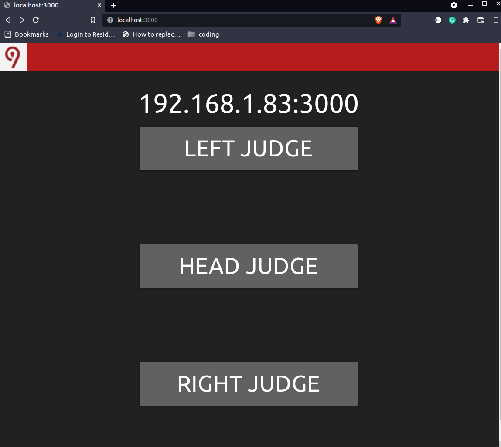

# 9 for 9 Powerlifting Lightbox
powerlifting lightbox

This applicaton is meant to give powerlifting competitions an easy to use electronic lightbox. Gone are the days of wires and physical lights. 9 for 9 Powerlifting Lightbox is the only open source lightbox around.

## Dependencies

This program requires Node.js and npm (node package manager)

### Debian based distros
`sudo apt install nodejs npm`

### Arch based distros
`sudo pacman -S nodejs npm`

### Red Hat based distros
`sudo dnf install nodejs npm`

### Mircosoft Windows
If you choose to use windows then you must go download node and npm installer from here https://nodejs.org/en/download/

I would reccomend the 64-bit Windows Installer (.msi)

## How to Use on Linux

This application is meant to be installed onto a single machine. The application will run a web server and a desktop app. Using the judges phones or other devices the judge can connect to the LAN and use this app. This app does not require internet but does require a local network to communicate with.

1) Download the project. This can be done many ways.
    
    `git clone https://github.com/hinsonan/9_for_9_Powerlifting_Lightbox.git`

    or go to https://github.com/hinsonan/9_for_9_Powerlifting_Lightbox/releases and download the latest source code. Extract the zip contents to a destination on your computer. (Note: The releases may run behind the master branch but should be more stable)

2) Change directory to project folder: `cd 9_for_9_Powerlifting_Lightbox`

3) Install the application (This step requires internet connection to download dependencies)

    `npm install`

4) Run the Application

    `npm start`

    The lightbox should pop up looking like this
    

5) open web browser and go to localhost:3000

    The client local website should appear. Layout may look different on mobile devices.
    

6) Users that are connected to the LAN can type in the IP address and port they see on the screen on any mobile web browser

7) You are all set. feel free to close the web browser once the judges get connected and resize the lightbox to be the size you want. Pro tip F11 will full screen the lightbox.

## How to Use on Microsoft Windows

This application is meant to be installed onto a single machine. The application will run a web server and a desktop app. Using the judges phones or other devices the judge can connect to the LAN and use this app. This app does not require internet but does require a local network to communicate with. In the future some batch scripts need to be made to make this easier. You can thank Microsoft and their proprietary OS.

1) Download the project. This can be done many ways.
    
    `git clone https://github.com/hinsonan/9_for_9_Powerlifting_Lightbox.git`

    or go to https://github.com/hinsonan/9_for_9_Powerlifting_Lightbox/releases and download the latest source code. Extract the zip contents to a destination on your computer. (Note: The releases may run behind the master branch but should be more stable)

2) Change directory to project folder: `cd 9_for_9_Powerlifting_Lightbox`

3) Install the application (This step requires internet connection to download dependencies)

    `cd 9_for_9_Powerlifting_Lightbox\client_side_judge_web_app`
    
    `npm install`
    
    `cd 9_for_9_Powerlifting_Lightbox\electron_server_lightbox`
    
    `npm install`

4) Run the Application
    
    `cd 9_for_9_Powerlifting_Lightbox\electron_server_lightbox`
    
    `npm start`

    The lightbox should pop up looking like this
    
    
    In a seperate CMD prompt 
    
    `cd 9_for_9_Powerlifting_Lightbox\client_side_judge_web_app`
    
    `npm start`
    
    NOTE: It is important to start the lightbox up before the client web server because of the web socket connections

5) open web browser and go to localhost:3000

    The client local website should appear. Layout may look different on mobile devices.
    

6) Users that are connected to the LAN can type in the IP address and port they see on the screen on any mobile web browser

7) You are all set. feel free to close the web browser once the judges get connected and resize the lightbox to be the size you want. Pro tip F11 will full screen the lightbox.

## Donate

If you enjoy this product I would greatly appreciate a donation of any amount. This code and program is free and open source, however food on the table is not.

